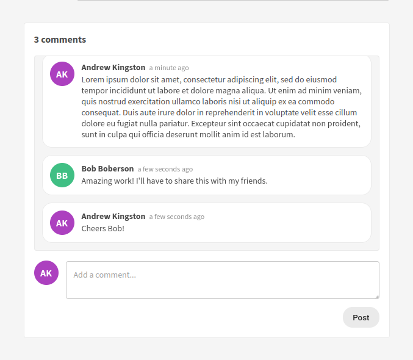
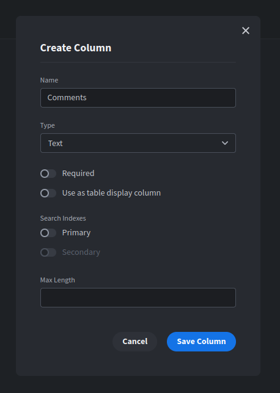

# Budibase Comment Box



A comment box component for easily adding comments to records.

Find out more about [Budibase](https://github.com/Budibase/budibase).

### Features
- Easy setup
- Automatic timestamping and avatars for users
- Comments can be deleted
- Max height set, with scrollable comment history
- No limit on number of comments
- Press enter to post a comment

## Usage
This plugin stores full comment histories, including names and timestamps, encoded inside
a single text field.

To use this plugin, you'll need to create a column for your comments. If you're using
an internal table, a simple text column will work perfectly. If you're using a SQL table,
simply pick any string-compatible column.



The settings this plugin requires are:
- A table datasource (either internal, or a SQL table)
- A string column to store your comments
- A row ID to attach the comments to

## Building

To build your new  plugin run the following in your Budibase CLI:
```
budi plugins --build
```

You can also re-build everytime you make a change to your plugin with the command:
```
budi plugins --watch
```

